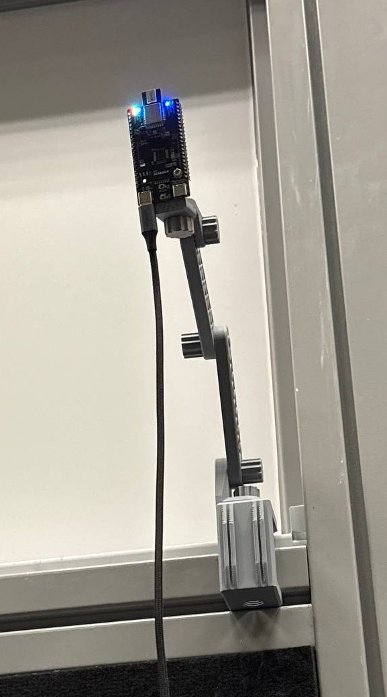
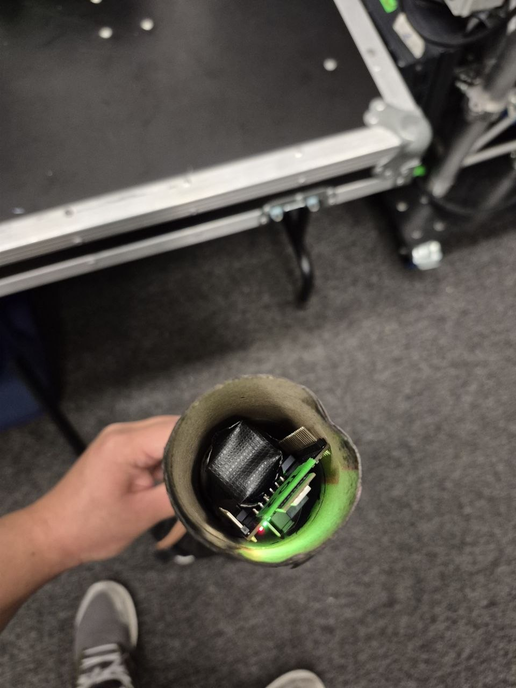
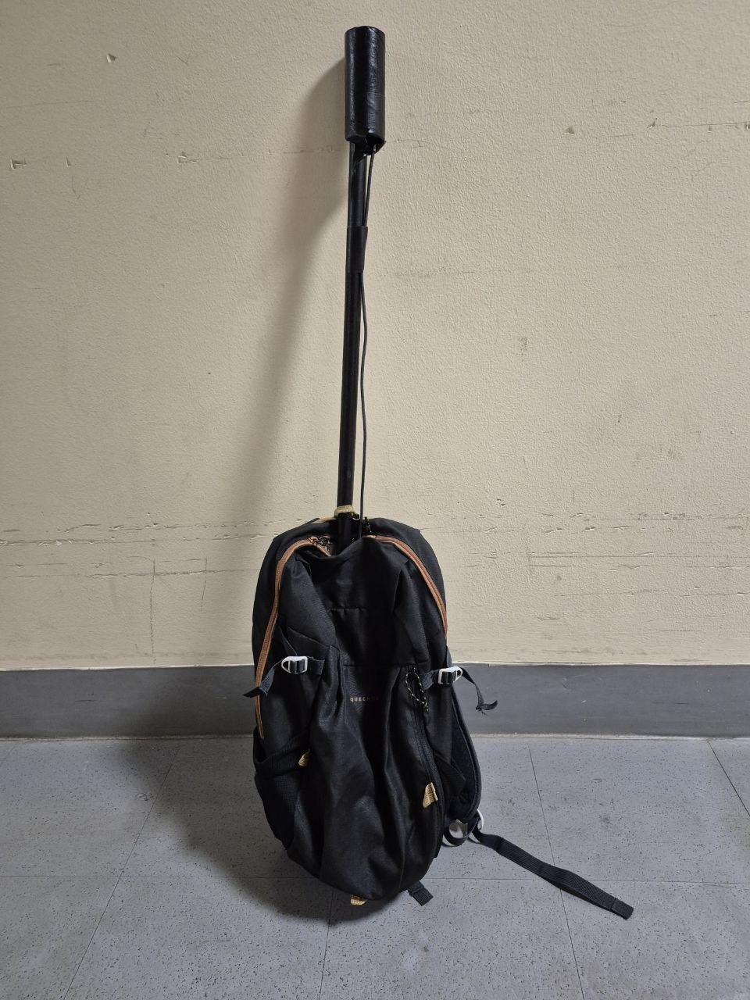

# 314 Project Phantom MVP: Final Containment(Station 4)
An interactive and physical game of ghost hunting where player position determines real-time tracking with audio and visual cues to elimate the ghosts.

## Table of contents
1. [Project Overview](#1-Project-Overview)
2. [How The Game Works](#2-how-the-game-works)
3. [Game Setup](#3-game-setup)
*  3.1 [Real-Time Tracking Setup](#31-tag-and-anchor-setup)
*  3.2 [Button Setup](#32-button-setup)
*  3.3 [Gun Setup](#33-gun-setup)
4. [Software Setup](#4-software-setup)
*  4.1 [Audio](#41-audio-cues-setup)
*  4.2 [Visual](#42-lighting-cues-setup)
5. [Conditions For The Game](#5-conditions-for-the-game)
*  5.1 [Win Conditions](#51-win-condition)
*  5.2 [Lose Conditions](#52-lose-condition)
6. [Final Outcome](#6-final-outcome)


## 1. Project Overview
An interactive, physical ghost-hunting experience where real-world player position drives a live game. Players carry UWB (ultra-wideband) location tags; the system trilaterates their position in an arena, checks it against "ghost" containment zones, and reacts in real time with a live arena visualization, dynamic stage lighting (grandMA3), and spatial audio (REAPER + L-ISA). Dispelling a ghost means physically walking into its zone and pressing a handheld button at the right moment.


## 2. How The Game Works
Players will be in an arena space which is in 536 classroom to clear ghosts("zones") across progressive waves before the countdown timer stops.

#### Tutorial Phase
* The application launches into a standby state.
* Players complete interactive tutorial prompts to learn position-tracking and pin/button mechanics.

#### Wave Progression & Area Clearing
* Completing the tutorial initiates the master countdown timer and unmutes the venue audio system.
* Target zones ("Ghosts") render on the arena map corresponding to the active Wave (Waves 1 through 3).
* There are 3 ghosts each in wave 1 and 2 and in the final wave there is one final boss to hunt.
* Players must physically move their assigned tracking tags into active target circles to clear them.
* Listen to the audio cues and and see the visual cues which is the lightings to know where the ghosts are.
* Clearing all target zones in the current wave automatically advances the arena to the next Wave stage.

```python
def setup_wave_ghosts():
    names = ["Bob", "Stewart", "Tim", "Kevin", "Carl", "Dave", "Jerry"]
    colors = ["#ffff00", "#00ff95", "#ff9900", "#00e1ff", "#f088f0", "#ff007f", "#fc9090"]
    ZONE_RADIUS = 0.80 
    
    ghosts_list = [
        {"center": (2.5, 6.0), "radius": ZONE_RADIUS, "min_radius": 0.10, "color": colors[0], "label": names[0], "active": True, "wave": 1},
        {"center": (7.0, 6.0), "radius": ZONE_RADIUS, "min_radius": 0.10, "color": colors[1], "label": names[1], "active": True, "wave": 1},
        {"center": (4.75, 3.5), "radius": ZONE_RADIUS, "min_radius": 0.10, "color": colors[2], "label": names[2], "active": True, "wave": 1},
        {"center": (2.5, 2.5), "radius": ZONE_RADIUS, "min_radius": 0.10, "color": colors[3], "label": names[3], "active": True, "wave": 2},
        {"center": (7.0, 2.5), "radius": ZONE_RADIUS, "min_radius": 0.10, "color": colors[4], "label": names[4], "active": True, "wave": 2},
        {"center": (4.75, 6.0), "radius": ZONE_RADIUS, "min_radius": 0.10, "color": colors[5], "label": names[5], "active": True, "wave": 2},
    ]
    
    # Generate random static coordinates for Wave 3 (Jerry)
    while True:
        rand_x = random.uniform(1.0, 8.5)
        rand_y = random.uniform(1.0, 7.0)
        too_close = False
        for existing in ghosts_list:
            ex, ey = existing["center"]
            if (rand_x - ex)**2 + (rand_y - ey)**2 < (1.80 ** 2):
                too_close = True
                break
        if not too_close:
            break

    ghosts_list.append({
        "center": (rand_x, rand_y),
        "radius": ZONE_RADIUS, 
        "min_radius": 0.10, 
        "color": colors[6], 
        "label": names[6], 
        "active": True, 
        "wave": 3
    })
    return ghosts_list

Ghosts = setup_wave_ghosts()
```

#### Win / Loss Conditions
* **Victory:** All target zones across all waves are cleared before the countdown hits `0.0s`.
* **Defeat:** The timer reaches `0.0s` while active targets remain uncleared.

---

Next we will show you how the game is setup together with the software.

## 3. Game Setup
When setting up the game, we need some physical components to make the game work like tags and anchor, button, and lastly creating of the gun so it makes the game looks real and interesting.

### 3.1 Tag and Anchor Setup
The Ghost Game uses six fixed UWB anchors positioned around the play area to create a tracking zone. The anchors communicate with the UWB tag carried by the player, allowing the system to measure distances and calculate the player's real-time position within the game area.

The anchors act as fixed reference points, while the tag moves with the player. By using the distance measurements between the tag and multiple anchors, the system can determine the player's location and track their movement in relation to the virtual ghosts.

This is 1 of 6 anchors positioned around the play area for a tracking zone.


This is the top view of the tag used during MVP

The UWB tag was positioned at a higher level on the player to reduce the possibility of signal obstruction caused by the human body. Since the human body can interfere with or block the direct signal path between the UWB tag and the surrounding anchors, placing the tag higher provides a clearer line of sight to the anchors.

This helps improve the reliability and stability of the distance measurements as the player moves around the tracking area. The higher placement also reduces the chance of the tag being obstructed by the player's body, helping the UWB system maintain more consistent tracking performance.



The UWB tag was attached to the end of a rod, which was then placed inside a haversack worn by the player. This setup positioned the tag higher on the player's body, helping to reduce signal obstruction caused by the human body. By elevating the tag, a clearer line of sight was maintained between the tag and the surrounding UWB anchors, improving the reliability and consistency of the tracking system during gameplay.


```python

ANCHORS = {
    0: (0.0, 0.0),
    1: (0.0, 3.9),
    2: (0.0, 8.16),
    3: (9.5, 8.14),
    4: (9.5, 3.8),
    5: (9.5, 0.0),
}

VIEW_BOUNDS = (-1.50, 12.0, -1.50, 12.0)
GhostHitTol = 0.25  
```

### 3.2 Button Setup
The dispel trigger is a single momentary push button wired to the Raspberry Pi's GPIO, read continuously in the background and forwarded to the game laptop as an event.

#### Wiring

| Pi Pin | Connection |
|---|---|
| GPIO 18 (BCM) | Button signal leg |
| GND | Button other leg |

The button is configured with an **internal pull-up**, so the pin reads HIGH when idle and LOW when pressed — `gpiozero` handles the inversion automatically.

```python
from gpiozero import Button

BUTTON_PIN = 18  # GPIO 18

button = Button(BUTTON_PIN, pull_up=True, bounce_time=0.2)
```

- `pull_up=True` — enables the internal pull-up resistor so no external resistor is needed
- `bounce_time=0.2` — 200ms software debounce, prevents a single physical press from registering as multiple rapid presses

#### Event handling

`gpiozero` exposes clean press/release callbacks, which are bound to a small helper that sends an OSC message to the game laptop:

```python
def send_button_event(is_pressed: bool):
    print(f"[PI] Button {'PRESSED' if is_pressed else 'RELEASED'} -> Sending to Laptop")
    client.send_message("/button", 1 if is_pressed else 0)

button.when_pressed  = lambda: send_button_event(True)
button.when_released = lambda: send_button_event(False)
```

Every press/release is sent as an OSC message to `/button` with a payload of `1` (pressed) or `0` (released). On the laptop side, `main.py` listens for this address and only acts on the **press** edge (not release) to avoid double-triggering:

```python
disp.map("/button", handle_remote_button)
```

For development without a Pi, the laptop also binds the **spacebar** to the same event handler, so the whole game can be tested without any hardware attached.

These photos shows the placement of the Raspberry Pi and button


---

### 3.3 Gun Setup

The "gun" is the handheld unit each player carries — it combines the **position tag** (UWB, reporting distance to anchors over UART) and the **dispel button** into one Raspberry Pi–driven transmitter. Its only job is to read hardware and forward everything to the game laptop over the network via OSC; it does no game logic itself.

#### Components

- Raspberry Pi (or Pi Zero, depending on form factor)
- UWB tag module wired to the Pi's UART (`/dev/ttyS0` or `/dev/ttyUSB0`)
- Momentary push button on GPIO 18 (see [Button Setup](#1-button-setup))
- Wi-Fi connection to the same network as the game laptop

#### Configuration

Before deploying a gun, set these constants at the top of `pi_transmitter.py`:

```python
LAPTOP_IP = "192.168.1.XXX"  # Game laptop's local IP address
PORT = 5005                  # Must match --port used when launching main.py

SERIAL_PORT = "/dev/ttyS0"   # Or /dev/ttyUSB0 for a USB-to-UART adapter
BAUD_RATE = 115200
BUTTON_PIN = 18
```

> ⚠️ `LAPTOP_IP` is a placeholder — it must be updated to the actual laptop IP before each session, since it can change between networks/venues.

#### Runtime behavior

On startup, the gun opens a serial connection to the UWB tag and an OSC client pointed at the laptop:

```python
client = udp_client.SimpleUDPClient(LAPTOP_IP, PORT)
ser = serial.Serial(SERIAL_PORT, BAUD_RATE, timeout=0.1)
ser.flushInput()
```

It then loops continuously:

1. **Reads a line from UART** whenever data is available — the tag reports distances as a CSV string: `tag_id, d0, d1, d2, d3, d4, d5`
2. **Validates the packet** — needs at least 7 comma-separated values (1 tag ID + 6 anchor distances) to match what `network.py` expects on the laptop side
3. **Converts and forwards** the values as a `/distances` OSC message; malformed lines are silently skipped
4. **Button presses/releases** fire independently and asynchronously via the `gpiozero` callbacks described above — they aren't tied to the UART polling loop, so the gun stays responsive even if UART data is delayed

```python
if len(parts) >= 7:
    try:
        osc_payload = [float(val) for val in parts]
        client.send_message("/distances", osc_payload)
    except ValueError:
        pass  # Skip corrupted lines
```

A short `time.sleep(0.01)` keeps the polling loop from pegging the CPU while still comfortably outpacing the 20Hz throttle applied on the receiving end (`network.py`).

#### Multiple guns

Each gun just needs a unique `tag_id` embedded in its UART payload — the laptop auto-assigns each new physical tag ID to the next free UI "slot" the first time it's seen, so no per-gun code changes are required beyond flashing/wiring the tag itself.

---


## 4. Software Setup
Software setup is needed for audio cues and visual cues so that players will be able to hunt the ghosts by lightings and listening to the sound.

### 4.1 Audio Cues Setup
#### Audio Cue Setup

The Ghost Game uses REAPER to provide real-time audio cues based on the player's distance from a ghost. The `reaper.py` file communicates with REAPER using OSC commands and triggers different audio markers depending on the player's proximity.

Three main audio tracks are used for the proximity warning system:

- **Track 12 – Fast Beep:** Used when the player is very close to the ghost.
- **Track 13 – Medium Beep:** Used when the player is at a medium distance from the ghost.
- **Track 14 – Slow Beep:** Used when the player is further away from the ghost.

The `reaper.py` file assigns OSC actions to each of these audio cues. Track 12 is triggered using the fast beep marker, Track 13 is triggered using the medium beep marker, and Track 14 is triggered using the slow beep marker. :contentReference[oaicite:0]{index=0}

The audio cue is selected automatically based on the player's minimum distance from the ghost. When the player is further away, a slow beep is triggered. As the player gets closer, the system changes to a medium and then fast beep. The warning interval also becomes shorter, causing the beeps to occur more frequently as the player approaches the ghost. :contentReference[oaicite:1]{index=1} :contentReference[oaicite:2]{index=2}

The proximity levels are configured as follows:

| Distance from Ghost | Audio Cue | Track |
|---|---|---|
| More than 5 m and up to 8 m | Slow Beep | Track 14 |
| More than 2.5 m and up to 5 m | Medium Beep | Track 13 |
| More than 1 m and up to 2.5 m | Fast Beep | Track 12 |

This creates a dynamic warning system where the audio becomes faster and more frequent as the player approaches the ghost. When the player reaches the critical distance or successfully interacts with the ghost, a separate ghost-hit audio cue can also be triggered.

### 4.2 Lighting Cues Setup
The lights is used when players are in the zone of the ghosts, lights will light up so that players will know when to press the button to dispel the ghosts.

It communicates with the grandMA3 console using OSC network commands over UDP.

```python
GMA3_IP = "192.168.254.252"   # Replace with your grandMA3 console/laptop IP address
GMA3_PORT = 8080             # Default grandMA3 inbound OSC port
GMA3_ADDR = "/gma3/cmd"
```
```python
try:
    client = udp_client.SimpleUDPClient(GMA3_IP, GMA3_PORT)
    print(f"[LIGHTING] Connected to grandMA3 at {GMA3_IP}:{GMA3_PORT}")
except Exception as e:
    client = None
    print(f"[LIGHTING ERROR] Failed to initialize OSC client: {e}")
```
---

#### Game State & Arena Lighting

When the game state transitions through different phases, it triggers main global lighting looks across the arena:

| Game Phase | Trigger / Action | What the Lighting Console Does | Command Used |
| :--- | :--- | :--- | :--- |
| **Tutorial Complete / Game Start** | Player finishes tutorial; active gameplay begins. | Turns on **Sequence 1, Cue 1.0** (Green Wash) to fill the room. | `Goto Cue 1.0 Sequence 1` |
| **Wave 3 (Final Boss)** | Players clear Waves 1 & 2 and reach the final stage. | Starts the **Final Boss sequence**. | `Go+ Sequence 35` |
| **Game Victory / Mission Complete** | Players clear all target zones before time runs out. | Turns off all ghost lights & final boss light, then fires the **Victory Look**. | `Off Sequence 35`<br>`Off [All Ghost Sequences]`<br>`Go+ Sequence 36` |

```python
def trigger_final_ghost_light():
    """Triggers the lighting sequence for the Wave 3 Final Boss."""
    send_command(f"Go+ Sequence {FINAL_GHOST_SEQUENCE}")

def trigger_game_finish_light():
    """
    Kills the final boss sequence and all mapped ghost sequences,
    then triggers the game completion sequence.
    """
    # 1. Kills the Final Boss sequence explicitly
    send_command(f"Off Sequence {FINAL_GHOST_SEQUENCE}")
    
    # 2. Ensures all standard ghost sequences are off
    for seq_id in GHOST_SEQUENCES.values():
        send_command(f"Off Sequence {seq_id}")
        
    # 3. Triggers the Victory / Game Over Sequence
    send_command(f"Go+ Sequence {GAME_OVER_SEQUENCE}")
```

---

#### Ghost Target Spotlights

When a player physically enters an active ghost's target zone inside the arena, that ghost's spotlight sequence turns **ON**. Stepping out or dispelling the ghost turns the sequence **OFF**.

```python
GHOST_SEQUENCES = {
    0: 31,  # Ghost 0 (Bob)
    1: 32,  # Ghost 1 (Stewart)
    2: 37,  # Ghost 2 (Tim)
    3: 34,  # Ghost 3 (Kevin)
    4: 29,  # Ghost 4 (Carl)
    5: 33,  # Ghost 5 (Dave)
}

def set_ghost_light(ghost_index: int, turn_on: bool):
    """Triggers or turns off the specific Sequence mapped to a ghost."""
    seq_id = GHOST_SEQUENCES.get(ghost_index)
    if seq_id is not None:
        if turn_on:
            send_command(f"Go+ Sequence {seq_id}")
        else:
            send_command(f"Off Sequence {seq_id}")

```

#### Ghost Sequence Mapping Table

| Target ID | Ghost Character | Target Zone Color | grandMA3 Sequence ID | Action on Walk-In | Action on Walk-Out / Dispel |
| :---: | :--- | :--- | :---: | :--- | :--- |
| **0** | **Bob** (Wave 1) | Yellow | `Sequence 31` | `Go+ Sequence 31` | `Off Sequence 31` |
| **1** | **Stewart** (Wave 1) | Bright Green | `Sequence 32` | `Go+ Sequence 32` | `Off Sequence 32` |
| **2** | **Tim** (Wave 1) | Orange | `Sequence 37` | `Go+ Sequence 37` | `Off Sequence 37` |
| **3** | **Kevin** (Wave 2) | Cyan / Light Blue | `Sequence 34` | `Go+ Sequence 34` | `Off Sequence 34` |
| **4** | **Carl** (Wave 2) | Pink / Purple | `Sequence 29` | `Go+ Sequence 29` | `Off Sequence 29` |
| **5** | **Dave** (Wave 2) | Hot Pink | `Sequence 33` | `Go+ Sequence 33` | `Off Sequence 33` |
| **6** | **Jerry** (Wave 3 / Boss) | Red / Pink | `Sequence 35` | `Go+ Sequence 35` | `Off Sequence 35` |

---

#### Quick Lighting Test Checklist

Use this checklist to troubleshoot or verify grandMA3 setup during arena configuration:

1. **Verify Network IP:** Ensure the lighting computer or console is set to static IP `192.168.254.252` and listening on Port `8080`.
2. **Check Command Path:** Confirm the console's OSC configuration accepts command-line OSC string payloads under `/gma3/cmd`.
3. **Manual Command Test:** Test target execution directly from the console command line:
   * **Turn On:** `Go+ Sequence 31` (Triggers Bob's spotlight)
   * **Turn Off:** `Off Sequence 31` (Clears Bob's spotlight)

## 5. Conditions For The Game
When playing a game, there is always a need for conditions so players can either win or lose the game.

There are 3 conditions to the game as well. Firstly, when tag is in the zone and button is pressed, the ghosts will be dispel. Secondly, when tag is not in zone but button is pressed, timer will add 5 seconds. Lastly, when tag is in zone but button is not pressed, nothing will happen.

```python
def handle_button_event(state, is_pressed):
        with state.lock:
            state.button_pressed = is_pressed
            
            # Only trigger hit detection on button PRESS down
            if is_pressed and not state.game_won and not state.game_lost and state.timer_active:
                hit_detected = False
                
                # STEP 1: Process tag hit checks for current wave ghosts
                for tag_id, tag in enumerate(state.tags):
                    if tag.filt_position is None:
                        continue
                    
                    for zi, ghost in enumerate(game_logic.Ghosts):
                        if ghost.get("active", True) and ghost.get("wave") == game_logic.CURRENT_WAVE:
                            if game_logic.ptInGhost(tag.filt_position, ghost):
                                print(f"\n🎯 DISPELLED: Tag {tag_id} hit Wave {game_logic.CURRENT_WAVE} Ghost [{ghost['label']}]!")
                                ghost["active"] = False
                                hit_detected = True
                                
                                # Turn OFF the individual light for this dispelled ghost
                                lighting.set_ghost_light(zi, turn_on=False)

                # STEP 2: Evaluate Wave Progression & Audio / Lighting Triggers
                if hit_detected:
                    state.time_left += 30.0
                    
                    # Trigger Ghost Kill sound in Reaper & L-ISA
                    if hasattr(app, 'audio_controller'):
                        app.audio_controller.trigger_alarm()
                    
                    # Check if all ghosts in the CURRENT wave are dispelled
                    wave_cleared = all(
                        not g.get("active", True) 
                        for g in game_logic.Ghosts 
                        if g.get("wave") == game_logic.CURRENT_WAVE
                    )
                    
                    if wave_cleared:
                        if game_logic.CURRENT_WAVE < 4:
                            game_logic.CURRENT_WAVE += 1
                            print(f"\n🌊 WAVE CLEARED! Transitioning to Wave {game_logic.CURRENT_WAVE}...")
                            
                            # Trigger Sequence when reaching Wave 3 (Final Boss)
                            if game_logic.CURRENT_WAVE == 3:
                                lighting.trigger_final_ghost_light()

                            root.after(0, app.force_instant_ui_refresh)
                        else:
                            state.game_won = True
                            state.timer_active = False 
                            print("\n🏆 !!! WIN CONDITION ACHIEVED !!! All arena grid sectors cleared! 🏆")
                            
                            # Kills final boss light and triggers victory sequence
                            lighting.trigger_game_finish_light()

                            root.after(0, app.force_instant_ui_refresh)
                    else:
                        root.after(0, app.force_instant_ui_refresh)
                else:
                    # Penalty for pressing button without hitting a ghost
                    state.time_left -= 5.0
```

### 5.1 Win Condition
To win the game, players must physically navigate the arena and **dispel all target ghosts across all 3 Waves** before the master countdown timer reaches zero.

---

#### Step-by-Step Victory Rules

1. **Active Wave Tracking:**
   * Players start at **Wave 1**.
   * Standing inside a ghost's target zone and pressing the tag button dispels that ghost.
   * Each time a ghost is dispelled, **+30 seconds** are added to the remaining timer as a reward.

```python
# Checks if the physical button press occurred inside an active ghost's radius
for zi, ghost in enumerate(game_logic.Ghosts):
    if ghost.get("active", True) and ghost.get("wave") == game_logic.CURRENT_WAVE:
        if game_logic.ptInGhost(tag.filt_position, ghost):
            ghost["active"] = False
            hit_detected = True
            lighting.set_ghost_light(zi, turn_on=False)

if hit_detected:
    state.time_left += 30.0  # +30s Reward
```
2. **Wave Progression:**
   * Once all ghosts in the active wave are cleared, the system automatically advances to the next wave:
     * **Wave 1 Cleared:** Progresses to Wave 2.
     * **Wave 2 Cleared:** Progresses to Wave 3 (Final Boss Stage).

```python
# Check if all ghosts in the current wave are inactive
wave_cleared = all(
    not g.get("active", True) 
    for g in game_logic.Ghosts 
    if g.get("wave") == game_logic.CURRENT_WAVE
)

if wave_cleared:
    if game_logic.CURRENT_WAVE < 4:
        game_logic.CURRENT_WAVE += 1
        if game_logic.CURRENT_WAVE == 3:
            lighting.trigger_final_ghost_light()  # Triggers Wave 3 Boss Light
```

3. **Final Victory Trigger:**
   * Clearing the final ghost in **Wave 3** immediately triggers the **WIN CONDITION**.

```python
# Triggered when Wave 3 is cleared
else:
    state.game_won = True
    state.timer_active = False 
    lighting.trigger_game_finish_light()
```

---

#### Hardware & System Victory Actions

The moment the final ghost is dispelled, `game_state.py` automatically executes the following actions across all connected hardware systems:

| Hardware System | System Action | What Happens in the Arena |
| :--- | :--- | :--- |
| **Countdown Timer** | **Freezes / Stops** | The timer halts immediately to lock in the players' final completion time. |
| **Arena Display HUD** | **Victory Banner** | Screen updates to render: `!!! WIN CONDITION ACHIEVED !!! Area Cleared!` |
| **Stage Lighting (grandMA3)** | **Victory Look** | Extinguishes all active ghost/boss spotlights (`Off Sequence 35`) and fires the **Victory Celebration Sequence** (`Go+ Sequence 36`). |
| **Spatial Audio (REAPER / L-ISA)** | **Mute / Audio Cue** | Triggers the final dispel snapshot, halts proximity tracking audio, and safely mutes overall track output via OSC commands. |

---

#### Penalty Logic

> [!WARNING]
> **Incorrect Button Presses:** Pressing the tag button while **outside** an active ghost target zone results in an immediate **5-second time penalty** deducted from the master timer.

```python
if not hit_detected:
    # Deduct 5 seconds if button pressed outside any target zone
    state.time_left -= 5.0
```

### 5.2 Lose Condition

The game is lost if the countdown timer reaches zero before every ghost in all three waves has been dispelled.

#### Timer mechanics

The timer lives in shared game state and only starts counting once the tutorial is completed:

```python
self.time_left = 150.0       # 150-second countdown
self.timer_active = False    # Stays paused until tutorial is dismissed
```

Once active, `display.py`'s render loop decrements it every frame based on real elapsed time (not a fixed tick), so it stays accurate regardless of frame rate:

```python
if self.state.timer_active and not self.state.game_won and not self.state.game_lost:
    delta = now - self.state.last_time
    self.state.time_left -= delta
    self.state.last_time = now

    if self.state.time_left <= 0:
        self.state.time_left = 0
        self.state.game_lost = True
        self.state.timer_active = False
```

#### What affects the clock

| Action | Effect |
|---|---|
| Dispelling a ghost (button press inside a zone) | **+30 seconds** |
| Pressing the button outside any active zone | **−5 seconds** (penalty for a wasted/wrong press) |

This means the timer isn't purely a countdown — good play actively buys more time, so the lose condition is really "run out of misses and time before clearing all ghosts."

#### On loss

When `time_left` hits zero:

- `state.game_lost = True` and `state.timer_active = False` are set, freezing the game
- The arena canvas title updates immediately:
  ```python
  self.canvas.itemconfig(self.title_text, text="MISSION FAILED — OUT OF TIME!", fill="#ff0000")
  ```
- The same message/color is re-applied by `force_instant_ui_refresh()` if triggered from elsewhere, so the fail state is consistent no matter what path set it
- The timer HUD window turns red (`#ff5252`) once under 30 seconds remaining, giving players a visual warning before the loss actually happens:
  ```python
  timer_color = "#ff5252" if (self.state.time_left < 30.0 and self.state.timer_active) else "#00ffff"
  ```
- Once `game_lost` is `True`, `main.py`'s button handler stops processing hit detection entirely — further button presses have no effect on game state


## 6. Final Outcome

 📋 Final Setup & Outcome Summary — Ghost Hunting Game

A wrap-up summary of the complete game setup, how a session plays out end-to-end, and the two possible final outcomes.

---

### 6.1 Setup Overview

| Layer | Component | Status |
|---|---|---|
| **Positioning hardware** | 6× fixed UWB anchors + per-player UWB tags | Configured via `game_logic.ANCHORS` |
| **Player device ("gun")** | Raspberry Pi + UWB tag (UART) + push button (GPIO 18) | `pi_transmitter.py` |
| **Network transport** | OSC over UDP, Pi → Laptop | Port `5005` (`--port`) |
| **Position engine** | Trilateration + Kalman filter | `network.py`, `trilateration.py` |
| **Game engine** | Wave/ghost state, hit detection, timer | `game_logic.py`, `game_state.py`, `main.py` |
| **Spectator display** | Live arena map, tag table, timer HUD, tutorial | `display.py`, `tutorial_ui.py` |
| **Lighting** | grandMA3 via OSC | `lighting.py` |
| **Audio** | REAPER + L-ISA via OSC | `reaper.py` |

**End-to-end flow:** UWB tags measure distance → Pi reads UART + button, forwards via OSC → laptop trilaterates position → game logic checks position against active ghost zones → display updates live → button press attempts a dispel → lighting + audio react → timer and wave state update → repeat until win or loss.

---

### 6.2 Session Flow (Start to Finish)

1. **Launch** — `main.py` starts the OSC server, opens the arena display, and waits
2. **Tutorial** — players complete the 4-step onboarding panel; timer stays paused (`timer_active = False`) until this finishes
3. **Hunt begins** — timer starts at `150.0s`, green "wash" lighting cue fires
4. **Wave 1 → 2 → 3** — players track ghosts via proximity beeping, walk into zones, and press the button to dispel; each successful dispel is `+30s`, each wasted press is `−5s`
5. **Round ends** — either all 3 waves are cleared (**win**) or the timer hits `0` first (**loss**)

---

### 6.3 Final Outcomes

#### 🏆 Win
- Fires when the **last ghost of wave 3** is dispelled
- `game_won = True`, timer stops instantly at whatever time remains
- `lighting.trigger_game_finish_light()` clears all ghost/boss sequences and triggers the **Victory** cue on grandMA3
- Arena title switches to green: `"GAME OVER — AREA CLEARED! YOU WIN!"`

#### ☠️ Loss
- Fires when `time_left` reaches `0` before all waves are cleared
- `game_lost = True`, timer freezes at `0.0`
- Arena title switches to red: `"MISSION FAILED — OUT OF TIME!"`
- **No lighting or audio cue currently fires on loss** — this is the one asymmetry between the two outcomes

#### After either outcome
- Button presses stop affecting the game (`handle_button_event` checks `not game_won and not game_lost`)
- The arena title and timer HUD simply freeze on-screen showing final state — there is no dedicated results/summary screen
- No stats are persisted anywhere (no logging of waves cleared, hit/miss counts, or time remaining/overrun)
- Returning to a fresh round currently requires restarting the app — `game_won`, `game_lost`, `time_left`, and ghost `active` flags are not reset in-session

---

### 6.4 Setup Checklist

Use this to confirm a venue is ready before a session:

- [ ] All 6 anchor coordinates in `game_logic.ANCHORS` match the physical arena
- [ ] `VIEW_BOUNDS` in `game_logic.py` covers the full playable area
- [ ] Each gun's `LAPTOP_IP` in `pi_transmitter.py` points to the current laptop IP
- [ ] `--port` on the laptop matches `PORT` in every gun's config
- [ ] `GMA3_IP` / `GMA3_PORT` in `lighting.py` reachable, and `GHOST_SEQUENCES` / `FINAL_GHOST_SEQUENCE` / `GAME_OVER_SEQUENCE` match the grandMA3 show file
- [ ] `REAPER_IP` / `LISA_IP` in `reaper.py` reachable, and marker/action IDs match the current REAPER project
- [ ] Buttons debounced and tested on all guns (`bounce_time=0.2`)
- [ ] Tutorial content reviewed and up to date (`tutorial_ui.py`)
- [ ] `--tags` set to the correct number of players for the session

### 6.5 Gameplay in Action
This photo below shows the player should be positioned in gameplay holding the handheld gun (tag + button), with a mounted anchor visible behind them


---
### 6.6 Demo Video
This video recording below shows the screen recording of the game
[MVP RECORDING.zip](https://github.com/user-attachments/files/30385286/MVP.RECORDING.zip)
The recording below shows a screen capture of gameplay in action
https://drive.google.com/file/d/1WY7LVYyNPCTMdVvlaRalucw68OrxDq7S/view?usp=drive_link


