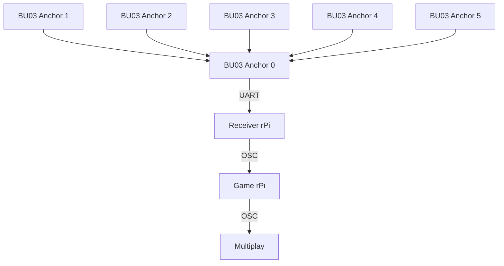

# EGL314 Experiental Ghost Hunting Game: POC
This contains the documentation of our experiential ghost hunting game utilising the **Ai-Thinker BU03-Kit** UWB modules (DW3000 + STM32F103) for live player tracking.  
This project has just passed the POC phase, and is documented as such.


## Table of Contents
1. [Project Overview](#1-Project-Overview)
2. [System Structure & Setup](#2-system-structure--setup)
* 2.1 [Basic structure](#21-basic-structure-of-system)
* 2.2 [Tag configuration](#22-tag-configuration)
3. [Repository Structure](#3-repository-structure)
* 3.1 [Game code for POC](#31-poc-game-code)
    * [Base of game](#base-game)
    * [Button input](#rapberry-pi-button-input)
    * [Ghost dispelling mechanic](#ghost-dispelling-mechanic)
    * [Winning condition](#win-condition)
    * [Lose condition](#lose-condition)
    * [Synchronised SFX with Multiplay and Python OSC](#synchronised-sfx-using-multiplay-and-python-osc)  
* 3.2 [Tutorial](Tutorial.md)


## 1. Project Overview
This project aims to create an immersive and interactive experience through a 'ghost hunting game'.  
  
For this, the following hardware and software are used:

| Item | Qty | Remarks |
| --- | --- | --- |
| BU03-Kit UWB modules | 8 | 6 anchors and 2 tags. |
| Raspberry Pi 4 Model B | 2 | 1 rPi for running game code, and another for receiving UWB data through UART.  |
| Multiplay | - | For synchronised audio feedback |
| Physical button | 1 | Connected to game rPi so it can take in the button input. |
| Jumper wires | 2 | Soldered to the button and connected to rPi GPIO 27 |


All this is used to create a game where players use an item equipped with a rPi, button, and tag board to find and dispel ghosts through audio and visual cues.  

In order to win, the player must dispel 3 ghosts within the 2 minute time limit by entering the vicinity of the ghost and pressing the button.   

Whenever a ghost is successfully dispelled, an additional 30 seconds is added, whereas if the button is pressed outside of the ghost's range, 5 seconds will be deducted.


## 2. System Structure & Setup
### 2.1 Basic structure of system

### Physical Setup
BU03 Anchors and Tags


### 2.2 Tag configuration


## 3. Repository Structure
### 3.1 POC game code
The programming of the game for POC includes the base game mechanic of dispelling ghosts with the tag and button, win/lose condition, synchronised SFX using Multiplay, and a [sequential tutorial](Tutorial.md).  

### Base game  
The game consists of three ghosts.  
The information for each ghost is stored as a **dictionary** within a **list**, named 'Ghosts' as follows:
```python
Ghosts = [
    {
        "center": (0.25, 0.625),
        "radius": 0.15,
        "min_radius": 0.10,
        "color": "#ffff00",
        "label": "Bob",
        "active": True,
    },
    {
        "center": (0.75, 1.0),
        "radius": 0.15,
        "min_radius": 0.10,
        "color": "#fff700",
        "label": "Stewart",
        "active": True,
    },
    {
        "center": (0.75, 0.25),
        "radius": 0.15,
        "min_radius": 0.10,
        "color": "#fff700",
        "label": "Kevin",
        "active": True,
    },
]
```   
### Rapberry Pi button input 

### Ghost dispelling mechanic

### Win Condition
For the player to win, they must first carry a tag and the button.  
The player must both be in the vicinity of the ghost and press the button to dispel the ghost.  
Clear all three ghosts within the alloted time to win.
### Lose Condition
For the player to lose, player must carry a tag and a button.
The game starts with a 120-second countdown timer.
Each time the player successfully dispels a ghost by pressing the correct button while inside the correct zone, 30 seconds are added to the remaining time.
If the player attempts to dispel a ghost incorrectly (for example, pressing the wrong button or pressing outside the designated zone), 5 seconds are deducted from the remaining time.
The player loses when the countdown timer reaches 0 seconds before all ghosts are dispelled.
### Synchronised SFX using Multiplay and Python OSC
