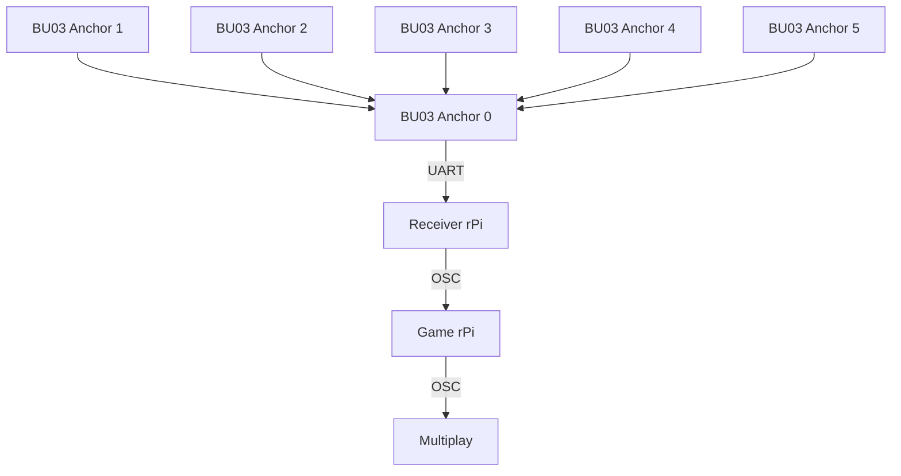

# EGL314 Experiental Ghost Hunting Game: POC
This repository contains the documentation of our experiential ghost hunting game utilising the **Ai-Thinker BU03-Kit** UWB modules (DW3000 + STM32F103) for live player tracking.  
This project has just passed the POC phase, and is documented as such.


## Table of Contents
1. [Project Overview](#1-Project-Overview)
2. [System Structure & Setup](#2-system-structure--setup)
* 2.1 [Basic structure](#21-basic-structure-of-system)
* 2.2 [Software & Hardware Setup](#22-software--hardware-setup)
* 2.3 [Tag configuration & Setup](#23-setup-of-tags--configuration)
3. [Game code for POC](#3-poc-game-code)  
* 3.1 [Tutorial](Tutorial.md)
4. [Running the game](#4-running-the-game)
5. [Repository Layout](#5-repository-layout)
  

# 1. Project Overview
This project aims to create an immersive and interactive experience through a 'ghost hunting game'.  
  
For this, the following hardware and software are used:

| Item | Qty | Remarks |
| --- | --- | --- |
| BU03-Kit UWB modules | 8 | 6 anchors and 2 tags. |
| Raspberry Pi 4 Model B | 2 | 1 rPi for running game code, and another for receiving UWB data through UART.  |
| Multiplay | - | For synchronised audio feedback |
| Physical button | 1 | Connected to game rPi so it can take in the button input. |
| Jumper wires | 2 | Soldered to the button and connected to rPi GPIO 27 |


All this is used to create a game where players use an item equipped with a rPi, button, and tag board to find and dispel ghosts through audio and visual cues.  

In order to win, the player must dispel 3 ghosts within the 2 minute time limit by entering the vicinity of the ghost and pressing the button.   

Whenever a ghost is successfully dispelled, an additional 30 seconds is added, whereas if the button is pressed outside of the ghost's range, 5 seconds will be deducted.


# 2. System Structure & Setup

## 2.1 Basic structure of system

## 2.2 Software & Hardware Setup
Before we start configuring the boards, we need to do some software setup for the Raspberry Pi by activating virtual environments and installing the required dependencies along with some hardware setup to connect the button to the Raspberry Pi.

Click [here](hardwareSoftwareSetup.md) for how.


## 2.3 Setup of tags & configuration
In this project, a single Ai-Thinker BU03-Kit module is configured as a tag, while six other modules are configured as fixed anchors placed around the game area. These are the fixed reference points used to calculate position.  

### Physical Setup


The Raspberry Pi then reads live distance data from Anchor 00 over UART and sends it to our Game rPi which performs 2D multilateration, smooths the result with a Kalman filter, and renders live positions in a Tkinter and Matplotlib GUI.  
  
For this, each board has to be configured such that it understands its purpose and what it has to do.  

To learn more about how the BU03 modules work and how they are configured, click [here](TagSetupConfig.md)


# 3. POC game code
The programming of the game for POC includes the base game mechanic of dispelling ghosts with the tag and button, win/lose condition, synchronised SFX using Multiplay, and a [sequential tutorial](Tutorial.md).  

To view the in-depth guide on the GamePOC.py file, click [here](POCgameCode.md)

# 4. Running Tutorial and Game
To run the tutorial and game, first run uart.py on the receiver rPi using CLI inside the environment created during [software setup](https://github.com/huisenlim/EGL314TeamD/blob/main/hardwareSoftwareSetup.md#installing-virtual-environment):
```
python3 uart.py --host x.x.x.x --port 5005 --tags 1
```
Where x.x.x.x is the IP address of the game rPi.  
  
Then, simply run POCtutorial.py and GamePOC.py on the game rPi through CLI or VScode.


# 5. Repository Layout
```
.
├── README.md                  # this file
├── GamePOC.py                 # game file for POC
├── uart.py                    # for UART receiver pi
├── POCtutorial.py             # tutorial game file for POC
├── POCgameCode.md             # game file documentation
├── tutorial.md                # tutorial game file documentation
├── hardwareSoftwareSetup.md   # setup of hardware and software
├── TagSetupConfig.md          # setup and configuration of tag boards
└── ConfigFiles/               
    ├── bu03_detect.py         # UART connection confirmation
    ├── bu03_multi_config.py   # to config ID/role for each board
    ├── bu03_inspect.py        # reads back configuration
    ├── viewer_calibrate.py    # calibration for anchors
    └── check_uart.sh          # verification of UART mapping
```
