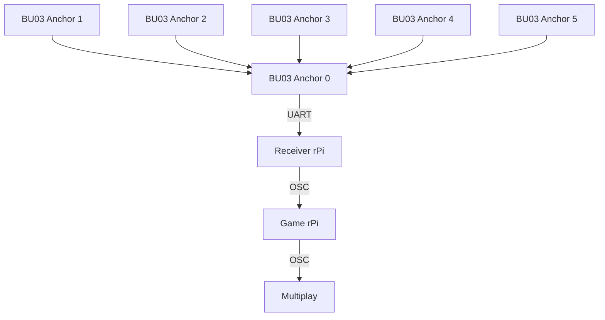

# EGL314 Experiental Ghost Hunting Game: POC
This contains the documentation of our experiential ghost hunting game utilising the **Ai-Thinker BU03-Kit** UWB modules (DW3000 + STM32F103) for live player tracking.  
This project has just passed the POC phase, and is documented as such.


## Table of Contents
1. [Project Overview](#1-Project-Overview)
2. [System Structure & Setup](#2-system-structure--setup)
* 2.1 [Basic structure](#21-basic-structure-of-system)
* 2.2 [Tag configuration](#22-tag-configuration)
3. [Repository Structure](#3-repository-structure)
* 3.1 [Game code for POC](#31-poc-game-code)
    * [Base of game](#base-game)
    * [Button input](#rapberry-pi-button-input)
    * [Ghost dispelling mechanic](#ghost-dispelling-mechanic)
    * [Winning condition](#win-condition)
    * [Lose condition](#lose-condition)
    * [Proximity beeping mechanic](#proximity-beeping-mechanic)  
* 3.2 [Tutorial](Tutorial.md)
* 3.3 [UART data receiver file](uart.py)


## 1. Project Overview
This project aims to create an immersive and interactive experience through a 'ghost hunting game'.  
  
For this, the following hardware and software are used:

| Item | Qty | Remarks |
| --- | --- | --- |
| BU03-Kit UWB modules | 8 | 6 anchors and 2 tags. |
| Raspberry Pi 4 Model B | 2 | 1 rPi for running game code, and another for receiving UWB data through UART.  |
| Multiplay | - | For synchronised audio feedback |
| Physical button | 1 | Connected to game rPi so it can take in the button input. |
| Jumper wires | 2 | Soldered to the button and connected to rPi GPIO 27 |


All this is used to create a game where players use an item equipped with a rPi, button, and tag board to find and dispel ghosts through audio and visual cues.  

In order to win, the player must dispel 3 ghosts within the 2 minute time limit by entering the vicinity of the ghost and pressing the button.   

Whenever a ghost is successfully dispelled, an additional 30 seconds is added, whereas if the button is pressed outside of the ghost's range, 5 seconds will be deducted.


## 2. System Structure & Setup
### 2.1 Basic structure of system

### Physical Setup
BU03 Anchors and Tags


### 2.2 Tag configuration
In this project, a single Ai-Thinker BU03-Kit module is configured as a tag, while six other modules are configured as fixed anchors placed around the game area. The system operates in Two-Way Ranging (TWR) mode, allowing the tag to measure its distance from each anchor without requiring clock synchronization. The tag continuously exchanges UWB signals with the anchors and outputs the calculated distance measurements through its data UART connection to a Raspberry Pi. Using the known coordinates of the anchors, the Raspberry Pi performs multilateration to determine the player's real-time position within the game environment. To improve tracking accuracy, calibration offsets are applied to compensate for ranging errors, and a Kalman filter is used to smooth position data and reduce measurement noise. This setup provides reliable indoor positioning for the ghost hunting game, enabling location-based gameplay mechanics such as ghost detection and dispelling.

## 3. Repository Structure
### 3.1 POC game code
The programming of the game for POC includes the base game mechanic of dispelling ghosts with the tag and button, win/lose condition, synchronised SFX using Multiplay, and a [sequential tutorial](Tutorial.md).  

### Base game  
The game consists of three ghosts.  
The information for each ghost is stored as a **dictionary** within a **list**, named 'Ghosts' as follows:
```python
Ghosts = [
    {
        "center": (0.25, 0.625),
        "radius": 0.15,
        "min_radius": 0.10,
        "color": "#ffff00",
        "label": "Bob",
        "active": True,
    },
    {
        "center": (0.75, 1.0),
        "radius": 0.15,
        "min_radius": 0.10,
        "color": "#fff700",
        "label": "Stewart",
        "active": True,
    },
    {
        "center": (0.75, 0.25),
        "radius": 0.15,
        "min_radius": 0.10,
        "color": "#fff700",
        "label": "Kevin",
        "active": True,
    },
]
```   

```python
def ptInGhost(point, ghost):
    if point is None:
        return False
    px, py = point
    zx, zy = ghost["center"]
    r = ghost["radius"] + GhostHitTol
    dx = px - zx
    dy = py - zy
    return (dx * dx + dy * dy) <= (r * r)
```
Determines where tag is from ghost


### Rapberry Pi button input 
This game requires a button input to create the ghost dispelling mechanic.   
For that, first install the Rasberry Pi GPIO:
```
pip install RPi.GPIO==0.7.1
```
Then import the library into the game file code:
```python
import RPi.GPIO as GPIO
```

### Ghost dispelling mechanic
When Player is in the zone where the ghosts is and when button is pressed, ghosts will be dispelled.

### Win Condition
For the player to win, they must first carry a tag and the button.  
The player must both be in the vicinity of the ghost and press the button to dispel the ghost.  
Clear all three ghosts within the allocated time to win.

### Lose Condition
The game starts with a 120-second countdown timer.  
Each time the player successfully dispels a ghost by pressing the correct button while inside the correct zone, 30 seconds are added to the remaining time.  
If the player attempts to dispel a ghost outside the designated zone, 5 seconds are deducted from the remaining time.  
The player will lose when the countdown timer reaches 0 seconds before all ghosts are dispelled.

### Proximity beeping mechanic
In order for players to decipher where ghosts are without a screen explicitly showing where the ghosts are, sound cues are added in order to hint at the location of the ghosts. 
   
4 different levels of beeping ranging in frequency will play depending on the distance of the player tag from the nearest ghost.   
  
The faster the beeping, the closer the player is. Multiplay and Python OSC will be used to facilitate this mechanic in order for it to be synchronised with the game.

```python
MULTIPLAY_IP   = "192.168.254.173"   # IP of the Multiplay machine
MULTIPLAY_PORT = 5005                # OSC UDP port Multiplay listens on
```

```python
SOUND_CUE_THRESHOLDS = [
    (0.0,   "/cue/4/go"),   # right on the ghost  (hit tolerance)
    (0.25,  "/cue/3/go"),   # very close
    (0.625, "/cue/2/go"),   # medium range
    (1.0,   "/cue/1/go"),   # far away
]
```

Return the minimum distance from point to any active ghost centre.
```python
def nearest_ghost_distance(point):
    active = [g for g in Ghosts if g.get("active", True)]
    if not active:
        return float("inf")
    return min(dist_to_ghost(point, g) for g in active)
```

```python
class MultiplayClient:
    def __init__(self, ip: str, port: int):
        self._client = SimpleUDPClient(ip, port)
        print(f"[multiplay] OSC client initialised → {ip}:{port}")
```
Thin wrapper around pythonosc SimpleUDPClient for triggering Multiplay cues.  
One shared instance is created at startup and re-used across all tags.  
Thread-safe: SimpleUDPClient.send_message() is stateless per call.  

```python
    def stop_all(self):
        try:
            self._client.send_message("/cue/all/stop", [])
            print("[multiplay] all cues stopped")
        except Exception as exc:
            print(f"[multiplay] stop_all failed: {exc}")
```
Stop every currently active cue in Multiplay (/cue/all/stop).

```python
    def trigger(self, address: str):
        try:
            self._client.send_message("/cue/all/stop", [])
            self._client.send_message(address, [])
            print(f"[multiplay] stopped all → cue sent: {address}")
        except Exception as exc:
            print(f"[multiplay] send failed ({address}): {exc}")
```

Stop all active cues, then immediately fire the requested cue.  
Stopping first guarantees no two proximity cues ever overlap, regardless of how Multiplay's own looping or auto-follow is configured.
 
