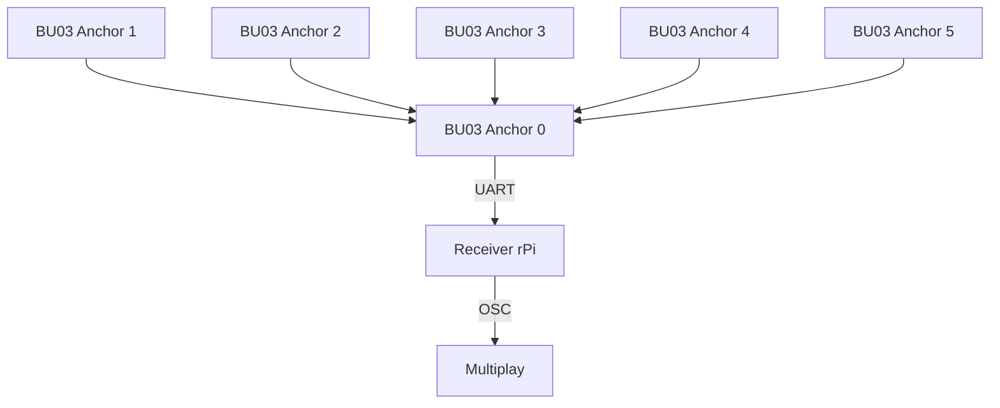

# EGL314 Experiental Ghost Hunting Game: POC
This contains the documentation of our experiential ghost hunting game utilising the **Ai-Thinker BU03-Kit** UWB modules (DW3000 + STM32F103) for live player tracking.  
This project has just passed the POC phase, and is documented as such.
## Table of Contents
1. [Project Overview](#Project-Overview)
2. [System Structure & Setup](#2-system-structure--setup)
* 2.1 [Basic structure](#21-basic-structure-of-system)
* 2.2 [Tag configuration](#22-tag-configuration)
3. [Repository Structure](#3-repository-structure)
* 3.1 Game code for POC
    * Base of game
    * Ghost dispelling mechanic & button input
    * Winning condition
    * Lose condition
    * Synchronised SFX with Multiplay
    * Tutorial

## 1. Project Overview
This project aims to create an immersive and interactive experience through a 'ghost hunting game'.  
  
For this, the following hardware and software are used:

| Item | Qty | Remarks |
| --- | --- | --- |
| BU03-Kit UWB modules | 8 | 6 anchors and 2 tags. |
| Raspberry Pi 4 Model B | 2 | 1 rPi for running game code, and another for receiving UWB data through UART.  |
| Multiplay | - | For synchronised audio feedback |
| Physical button | 1 | Connected to game rPi so it can take in the button input. |
| Jumper wires | 2 | Soldered to the button and connected to rPi GPIO 27 |

All this is used to create a game where players use an item equipped with a rPi, button, and tag board to find and dispel ghosts through audio and visual cues.  

In order to win, the player must dispel 3 ghosts within the 2 minute time limit by entering the vicinity of the ghost and pressing the button.   

Whenever a ghost is successfully dispelled, an additional 30 seconds is added, whereas if the button is pressed outside of the ghost's range, 5 seconds will be deducted.

## 2. System Structure & Setup
### 2.1 Basic structure of system

### Physical Setup
BU03 Anchors and Tags

### 2.2 Tag configuration

## 3. Repository Structure