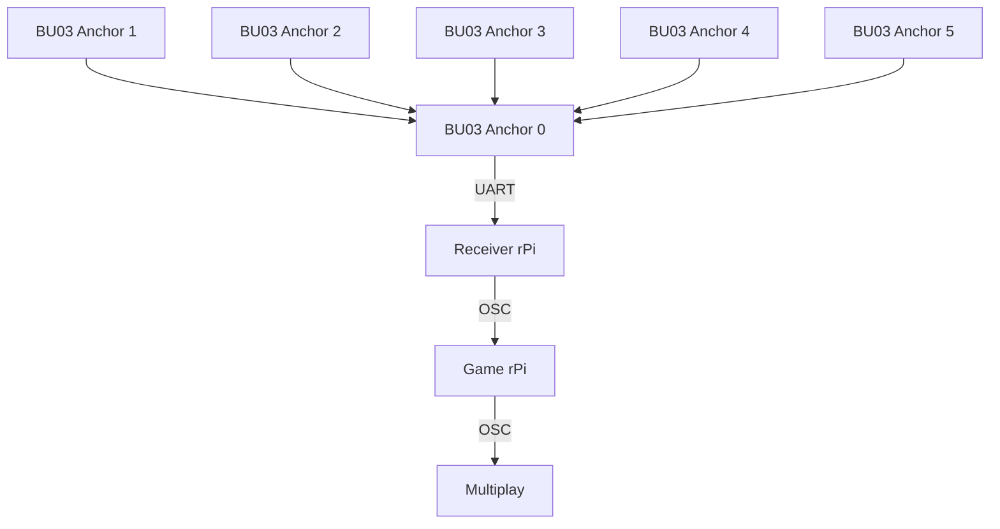

# EGL314 Experiental Ghost Hunting Game: POC
This contains the documentation of our experiential ghost hunting game utilising the **Ai-Thinker BU03-Kit** UWB modules (DW3000 + STM32F103) for live player tracking.  
This project has just passed the POC phase, and is documented as such.


## Table of Contents
1. [Project Overview](#1-Project-Overview)
2. [System Structure & Setup](#2-system-structure--setup)
* 2.1 [Basic structure](#21-basic-structure-of-system)
* 2.2 [Tag configuration & Setup](#22-setup-of-tags--configuration)
3. [Game code for POC](#3-poc-game-code)
    * [Base of game](#base-game)
    * [Button input](#rapberry-pi-button-input)
    * [Ghost dispelling mechanic](#ghost-dispelling-mechanic)
    * [Winning condition](#win-condition)
    * [Lose condition](#lose-condition)
    * [Proximity beeping mechanic](#proximity-beeping-mechanic)  
* 3.1 [Tutorial](Tutorial.md)
* 3.2 [UART data receiver file](uart.py)
4. [Repository Layout](#repository-layout)


## 1. Project Overview
This project aims to create an immersive and interactive experience through a 'ghost hunting game'.  
  
For this, the following hardware and software are used:

| Item | Qty | Remarks |
| --- | --- | --- |
| BU03-Kit UWB modules | 8 | 6 anchors and 2 tags. |
| Raspberry Pi 4 Model B | 2 | 1 rPi for running game code, and another for receiving UWB data through UART.  |
| Multiplay | - | For synchronised audio feedback |
| Physical button | 1 | Connected to game rPi so it can take in the button input. |
| Jumper wires | 2 | Soldered to the button and connected to rPi GPIO 27 |


All this is used to create a game where players use an item equipped with a rPi, button, and tag board to find and dispel ghosts through audio and visual cues.  

In order to win, the player must dispel 3 ghosts within the 2 minute time limit by entering the vicinity of the ghost and pressing the button.   

Whenever a ghost is successfully dispelled, an additional 30 seconds is added, whereas if the button is pressed outside of the ghost's range, 5 seconds will be deducted.


## 2. System Structure & Setup
### 2.1 Basic structure of system


### 2.2 Setup of tags & configuration
In this project, a single Ai-Thinker BU03-Kit module is configured as a tag, while six other modules are configured as fixed anchors placed around the game area.  
  
To do so, 

### Physical Setup


The system operates in Two-Way Ranging (TWR) mode, allowing the tag to measure its distance from each anchor (on the orange boxes) without requiring clock synchronization.   
  
The tag continuously exchanges UWB signals with the anchors and outputs the calculated distance measurements through its data UART connection to a Raspberry Pi.   
  
Using the known coordinates of the anchors, the Raspberry Pi performs multilateration to determine the player's real-time position within the game environment.   
  
To improve tracking accuracy, calibration offsets are applied to compensate for ranging errors, and a Kalman filter is used to smooth position data and reduce measurement noise.   
  
This setup provides reliable indoor positioning for the ghost hunting game, enabling location-based gameplay mechanics such as ghost detection and dispelling.

# 3. POC game code
The programming of the game for POC includes the base game mechanic of dispelling ghosts with the tag and button, win/lose condition, synchronised SFX using Multiplay, and a [sequential tutorial](Tutorial.md).  

## Base game  
The game consists of three ghosts.  
The information for each ghost is stored as a **dictionary** within a **list**, named 'Ghosts' as follows:
```python
Ghosts = [
    {
        "center": (0.25, 0.625),
        "radius": 0.15,
        "min_radius": 0.10,
        "color": "#ffff00",
        "label": "Bob",
        "active": True,
    },
    {
        "center": (0.75, 1.0),
        "radius": 0.15,
        "min_radius": 0.10,
        "color": "#fff700",
        "label": "Stewart",
        "active": True,
    },
    {
        "center": (0.75, 0.25),
        "radius": 0.15,
        "min_radius": 0.10,
        "color": "#fff700",
        "label": "Kevin",
        "active": True,
    },
]
```   

```python
def ptInGhost(point, ghost):
    if point is None:
        return False
    px, py = point
    zx, zy = ghost["center"]
    r = ghost["radius"] + GhostHitTol
    dx = px - zx
    dy = py - zy
    return (dx * dx + dy * dy) <= (r * r)
```
Determines where tag is from ghost


## Rapberry Pi button input 
This game requires a button input to create the ghost dispelling mechanic.   
For that, first install the Rasberry Pi GPIO:
  
```
pip install RPi.GPIO==0.7.1
```
Then import the library into the game file code:
```python
import RPi.GPIO as GPIO
```


### Pin Declaration & GPIO Setup

```python
BUTTON_PIN = 27
GPIO.setmode(GPIO.BCM)
GPIO.setup(BUTTON_PIN, GPIO.IN, pull_up_down=GPIO.PUD_UP)
```

This sets GPIO pin 27 as an input with an internal pull-up resistor, meaning the pin reads HIGH normally and goes LOW when the button is pressed.  

### Callback Function:

```python
def pin_edge_callback(channel):
    is_pressed = not GPIO.input(channel)
    with state.lock:
        state.button_pressed = is_pressed
        ...
```

This function runs automatically whenever the button is pressed or released. `not GPIO.input(channel)` flips the logic — since the pin is pull-up, a LOW signal (button pressed) becomes `True`.


### Edge Detection Registration

```python
GPIO.add_event_detect(BUTTON_PIN, GPIO.FALLING, callback=pin_edge_callback, bouncetime=200)
```

This is what actually "listens" for the button. `GPIO.FALLING` means it triggers on the HIGH→LOW transition (i.e. the moment the button is pressed down). The `bouncetime=200` is a 200ms debounce filter to prevent a single press from firing multiple times.


### Cleanup on Exit

```python
GPIO.cleanup()
```

At the very end in the `finally` block, this releases the GPIO pins safely when the program closes.

### Ghost Dispelling Mechanic
When Player is in the vicinity of a ghost and presses the button, the ghost will be dispelled.  

When button is pressed
``` python
 def pin_edge_callback(channel):
        is_pressed = not GPIO.input(channel)
        with state.lock:
            state.button_pressed = is_pressed

            # --- FORCE IMMEDIATE DEACTIVATION ON PRESS ---
            if is_pressed:
                for tag_id, tag in enumerate(state.tags):
                    if tag.filt_position is None:
                        continue
```
And tag is in the zone where the ghosts is,
```python
for zi, ghost in enumerate(Ghosts):
                        if ghost.get("active", True):
                            # Check if this tag is inside this ghost right now
                            if ptInGhost(tag.filt_position, ghost):
                                print(f"\n🎯 HIT! Tag {tag_id} dispelled {ghost['label']}!")
                                ghost["active"] = False
```
ghost will be removed by changing the ghost's active state to False.

## Win Condition
For the player to win, they must first carry the BU03 tag and button.  
The player must both be in the vicinity of the ghost and press the button to dispel the ghost.  
Clear all three ghosts within the allocated time to win.

Firstly, identify if tag is in the zone of the ghosts.
```python
for zi, ghost in enumerate(Ghosts):
                    if ghost.get("active", True):
                        if ptInGhost(tag.filt_position, ghost):
                            current_ghosts.add(zi)

                tag.ghosts_inside = {zi for zi in current_ghosts if Ghosts[zi]["active"]}

                for zi, ghost in enumerate(Ghosts):
                    if ghost.get("active", True):
                        is_in_zone = ptInGhost(tag.filt_position, ghost)
```

Secondly, set the condition the player has to achieve to win the game.
1. If button is pressed and tag is in the zone of the ghosts,
```python
 # Condition 1: Button is pressed AND tag is inside the ghost zone
                        if state.button_pressed and is_in_zone:
                            print(f"\n=== SUCCESS === Tag {tag_id} dispelled Ghost: {ghost['label']}!")
                            ghost["active"] = False
```
ghosts will be dispelled.

2. Else if button is pressed and tag is not in the zone of the ghosts,
```python
                        # Condition 2: Button is pressed AND tag is NOT inside the ghost zone
                        elif state.button_pressed and not is_in_zone:
                            pass # Ghost remains unaffected 
```
ghosts will remain.

3. Or, if button is not pressed and tag is in the zone of the ghosts,
```python
# Condition 3: Button is NOT pressed AND tag is inside the ghost zone
                        elif not state.button_pressed and is_in_zone:
                            current_ghosts.add(zi) # Ghost remains, mark as occupying zone
```
ghosts will remain.

Lastly, after all ghosts is removed within the timeframe, player wins the game.
```python
# Check for Win Condition (Are all ghosts turned off?)
                if all(not g.get("active", True) for g in Ghosts):
                    state.game_won = True
                    print("\n🏆 !!! CONGRATS!!! U WIN!!! ALL GHOSTS CLEARED!!! 🏆")
```

## Lose Condition
The game starts with a 120-second countdown timer.  
Each time the player successfully dispels a ghost by pressing the correct button while inside the correct zone, 30 seconds are added to the remaining time.  
  
If the player attempts to dispel a ghost outside the designated zone, 5 seconds are deducted from the remaining time.  
The player will lose when the countdown timer reaches 0 seconds before all ghosts are dispelled.


### 120-Second Countdown from Game Start

```python
# ---------------------------------------------------------------------------
# Timer Configuration
# ---------------------------------------------------------------------------
TIMER_START_SECONDS  = 120   # starting countdown
TIMER_BONUS_CAPTURE  = 30    # seconds added on successful ghost capture
TIMER_PENALTY_MISS   = 5     # seconds deducted on wrong button press
```

```python
self.timer_end = time.time() + TIMER_START_SECONDS  # NEW: absolute deadline
```

**Where:** `SharedState.__init__()` inside the `SharedState` class.

The timer is not a simple counter. Instead, `timer_end` stores an **absolute future timestamp** — the current time plus 120 seconds. The remaining time is always computed as `timer_end - time.time()`, which means all bonuses and penalties just shift this deadline forward or backward.


### Additional 30 Seconds on Successful Ghost Dispel

This happens in **two places** — once in the OSC handler (continuous tracking), and once in the GPIO button callback (instant press detection).

### In the OSC handler (`make_osc_handler`):

```python
# Condition 1: Button is pressed AND tag is inside the ghost zone
if state.button_pressed and is_in_zone:
    print(f"\n=== SUCCESS === Tag {tag_id} dispelled Ghost: {ghost['label']}!")
    ghost["active"] = False
    # Bonus time for successful capture
    state.timer_end += TIMER_BONUS_CAPTURE
    print(f"[timer] +{TIMER_BONUS_CAPTURE}s bonus — new remaining: {state.timer_end - time.time():.1f}s")
```

### In the GPIO button callback (`pin_edge_callback`):

```python
if ptInGhost(tag.filt_position, ghost):
    print(f"\n🎯 HIT! Tag {tag_id} dispelled {ghost['label']}!")
    ghost["active"] = False
    hit_any_ghost = True
    # Bonus time for successful capture
    state.timer_end += TIMER_BONUS_CAPTURE
    print(f"[timer] +{TIMER_BONUS_CAPTURE}s bonus — new remaining: {state.timer_end - time.time():.1f}s")
```
When a successful hit is confirmed (button pressed + player is inside the ghost's zone), `TIMER_BONUS_CAPTURE` (30) is added directly to `timer_end`, pushing the deadline 30 seconds further into the future.


### -5 Seconds Deducted on a Missed Button Press

```python
# NEW: penalty if button pressed but no ghost was hit
if not hit_any_ghost:
    state.timer_end -= TIMER_PENALTY_MISS
    remaining = state.timer_end - time.time()
    print(f"\n❌ MISS! No ghost hit — -{TIMER_PENALTY_MISS}s penalty. Remaining: {remaining:.1f}s")
```

**Where:** Still inside `pin_edge_callback`, immediately after the ghost-hit loop.

If the button is pressed but `hit_any_ghost` remains `False` (the player wasn't inside any active ghost zone), `TIMER_PENALTY_MISS` (5) is **subtracted** from `timer_end`, bringing the deadline 5 seconds closer.


### Player Loses When Timer Reaches 0

```python
# --- TIMER EXPIRY CHECK (lose condition) ---
with self.state.lock:
    time_remaining = self.state.timer_end - now
    already_lost   = self.state.game_lost
    already_won    = self.state.game_won

if not already_won and not already_lost and time_remaining <= 0:
    with self.state.lock:
        self.state.game_lost = True
    print("\n💀 TIME'S UP — GAME OVER! You lose! 💀")
```

**Where:** `ViewerApp.update_loop()`, which runs every ~66ms via `root.after(66, self.update_loop)`.

Every UI refresh cycle, `time_remaining` is recalculated. The moment it hits zero or below (and the game hasn't already been won), `game_lost` is set to `True`. The display then updates accordingly:

```python
elif already_lost:
    self.timer_text.set_text("TIME'S UP!")
    self.timer_text.set_color("#ff0000")
```

```python
elif self.state.game_lost:
    self.ax_plot.set_title("GAME OVER — TIME'S UP! YOU LOSE!", color="#ff0000", fontsize=16, weight="bold")
```

---

### Summary Table

| Event | Code Constant | Effect on `timer_end` | Location |
|---|---|---|---|
| Game starts | `TIMER_START_SECONDS = 120` | Set to `now + 120` | `SharedState.__init__()` |
| Ghost dispelled (hit) | `TIMER_BONUS_CAPTURE = 30` | `+= 30` | `pin_edge_callback` / `make_osc_handler` |
| Button pressed, no ghost hit | `TIMER_PENALTY_MISS = 5` | `-= 5` | `pin_edge_callback` |
| Timer reaches 0 | — | `game_lost = True` | `ViewerApp.update_loop()` |

## Proximity beeping mechanic
In order for players to decipher where ghosts are without a screen explicitly showing where the ghosts are, sound cues are added in order to hint at the location of the ghosts. 
   
4 different levels of beeping ranging in frequency will play depending on the distance of the player tag from the nearest ghost.   
  
The faster the beeping, the closer the player is.   
Multiplay and Python OSC will be used to facilitate this mechanic in order for it to be synchronised with the game.

First, the Multiplay IP address and port are defined in the game's code:
```python
MULTIPLAY_IP   = "192.168.254.173"   # IP of the Multiplay machine
MULTIPLAY_PORT = 5005                # OSC UDP port Multiplay listens on
```
Next, open Multiplay>Files>Preferences  
  
Then, open OSC Control and set the port to the corresponding port number while also enabling Control (Incoming).


Next, the information for the sound cue and its threshold is defined here as a list:
```python
SOUND_CUE_THRESHOLDS = [
    (0.0,   "/cue/4/go"),   # right on the ghost  (hit tolerance)
    (0.25,  "/cue/3/go"),   # very close
    (0.625, "/cue/2/go"),   # medium range
    (1.0,   "/cue/1/go"),   # far away
]
```
This allows the code to be able to retrieve information for each distance from this list consistently without having to manually type it in every time.

Return the minimum distance from the tag (point) to the centre of any active ghost.
```python
def nearest_ghost_distance(point):
    active = [g for g in Ghosts if g.get("active", True)]
    if not active:
        return float("inf")
    return min(dist_to_ghost(point, g) for g in active)
```

```python
class MultiplayClient:
    def __init__(self, ip: str, port: int):
        self._client = SimpleUDPClient(ip, port)
        print(f"[multiplay] OSC client initialised → {ip}:{port}")
```
Thin wrapper around pythonosc SimpleUDPClient for triggering Multiplay cues.  
One shared instance is created at startup and re-used across all tags.  
Thread-safe: SimpleUDPClient.send_message() is stateless per call.  

```python
    def stop_all(self):
        try:
            self._client.send_message("/cue/all/stop", [])
            print("[multiplay] all cues stopped")
        except Exception as exc:
            print(f"[multiplay] stop_all failed: {exc}")
```
Stop every currently active cue in Multiplay (/cue/all/stop).

```python
    def trigger(self, address: str):
        try:
            self._client.send_message("/cue/all/stop", [])
            self._client.send_message(address, [])
            print(f"[multiplay] stopped all → cue sent: {address}")
        except Exception as exc:
            print(f"[multiplay] send failed ({address}): {exc}")
```

Stop all active cues, then immediately fire the requested cue.  
Stopping first guarantees no two proximity cues ever overlap, regardless of how Multiplay's own looping or auto-follow is configured.
 
## Repository Layout
```
.
├── README.md                  # this file
├── GamePOC.py                 # game file for POC
├── uart.py                    # for UART receiver pi
├── POCtutorial.py             # Tutorial game file for POC
├── tutorial.md                # Tutorial game file documentation
└── ConfigFiles/               
    ├── bu03_detect.py         # UART connection confirmation
    ├── bu03_multi_config.py   # to config ID/role for each board
    ├── bu03_inspect.py        # reads back configuration
    ├── viewer_calibrate.py    # calibration for anchors
    └── check_uart.sh          # verification of UART mapping
```
