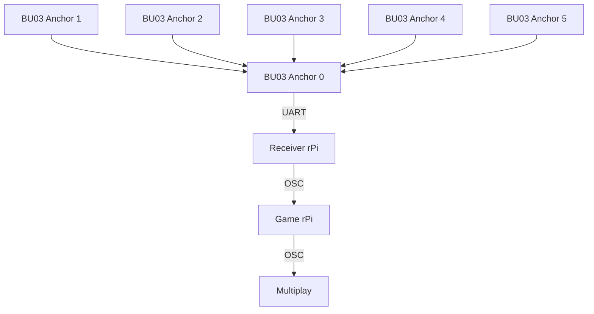

# System Structure & Setup

Back to [README.md](README.md)

## Basic structure of system

## Setup of tags & configuration
In this project, a single Ai-Thinker BU03-Kit module is configured as a tag, while six other modules are configured as fixed anchors placed around the game area. These are the fixed reference points used to calculate position.  

### Physical Setup

The system operates in Two-Way Ranging (TWR) mode, allowing the tag to measure its distance from each anchor (on the orange boxes) without requiring clock synchronization.   
  
The tag continuously exchanges UWB signals with the anchors and outputs the calculated distance measurements through its data UART connection to a Raspberry Pi.   
  
Using the known coordinates of the anchors, the Raspberry Pi performs multilateration to determine the player's real-time position within the game environment.   
  
To improve tracking accuracy, calibration offsets are applied to compensate for ranging errors, and a Kalman filter is used to smooth position data and reduce measurement noise.   

