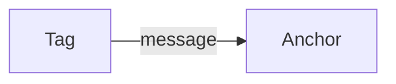
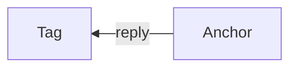
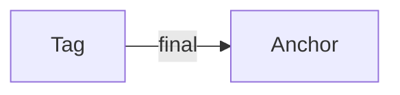
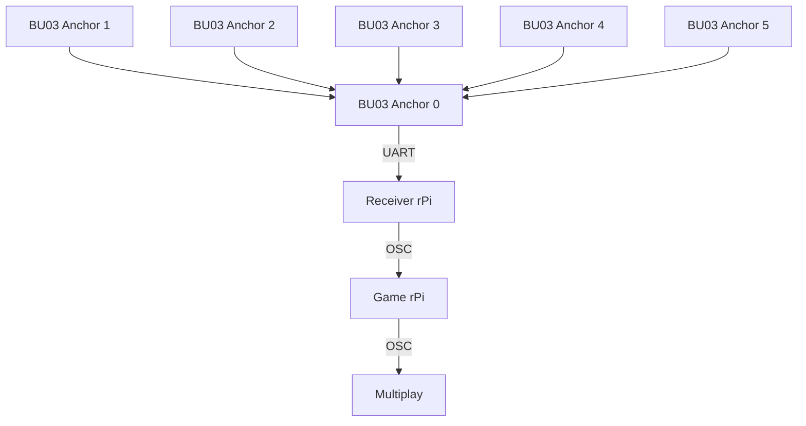

# Tag Configuration

Back to [README.md](README.md)

## How it works
The system operates in Two-Way Ranging (TWR) mode, allowing the tag to measure its distance from each anchor (on the orange boxes) without requiring clock synchronization.   
  
  
For each measurement cycle, the moving tag exchanges three timestamped UWB messages with each anchor:

From the timestamps captured, the tag converts it into a distance, and doing so against the 6 anchors gives the tag a vector distance.  
  
The calculated distance measurements are then output through its data UART connection to a Receiving Raspberry Pi like so:

The Receiver rPi then sends the raw UART data to the Game rPi using uart.py, which then uses the known coordinates of the anchors to perform multilateration to determine the player's real-time position within the game environment.   
  
To improve tracking accuracy, calibration offsets are applied to compensate for ranging errors, and a Kalman filter is used to smooth position data and reduce measurement noise.   

## Configuration of BU03 modules