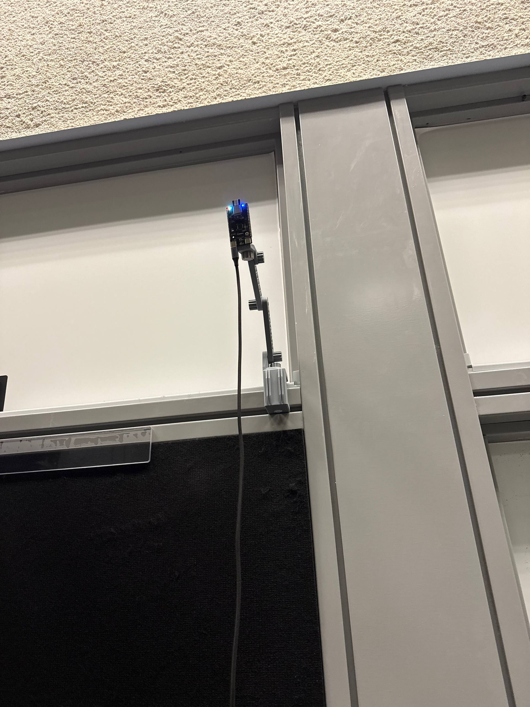
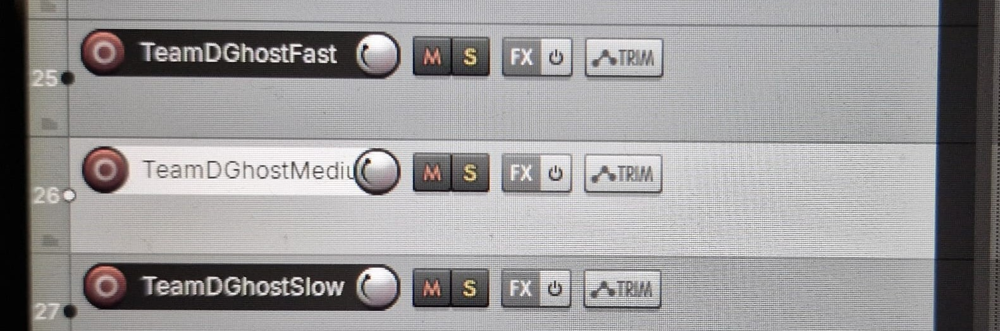
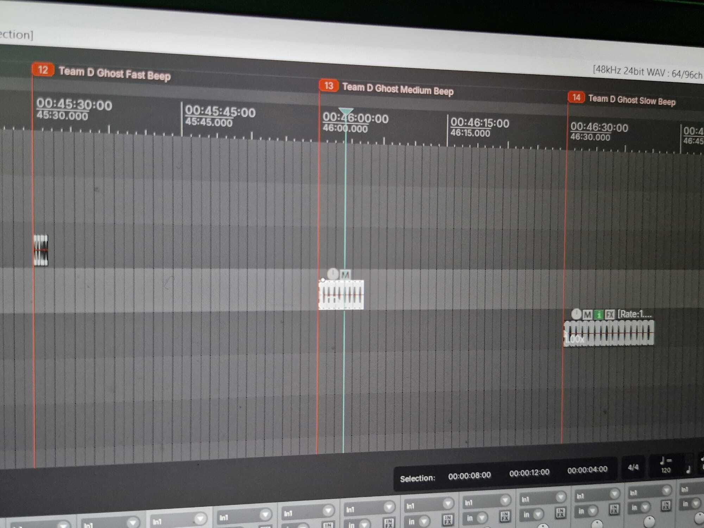

## UWB Tracking and Immersive Audio System

### Anchor and Tag Configuration

The Ghost Game uses a UWB-based positioning system to track the player's movement within the game area.

Six UWB anchors were positioned around the designated play area. A laser distance measurer was used to measure and verify the distances between the anchors, ensuring that the physical positions of the anchors were accurately configured.

Accurate anchor placement is important because the system uses the measured distances between the anchors and the UWB tag to calculate the player's position within the tracking area.

After configuring the six anchors, a UWB tag was configured to track the player within the anchor area. The tag continuously communicates with the anchors, allowing the system to track the player's real-time location.

This tracking system forms the foundation of the Ghost Game. The player's calculated position is used to determine their distance from virtual ghosts placed within the game environment. Based on the player's proximity to a ghost, different audio, lighting, and gameplay responses can be triggered.

#### UWB Anchor Configuration Showcase

This is an Anchor, which is 1 of 6 that are mounted on a 3D print above head-height level to prevent any obstructions.

[Click this link](YOUR_3D_PRINT_URL) to go to the 3D print used for this documentation.

---

### REAPER Audio Integration

To create the audio system for the Ghost Game, a dedicated `reaper.py` module was developed as part of the `GhostGame` codebase.

The Python game system communicates with REAPER using OSC (Open Sound Control). The player's distance from a ghost is continuously monitored by the game, and different audio responses are triggered depending on the player's proximity.

The warning beep becomes faster as the player gets closer to a ghost, creating a more immersive and suspenseful gameplay experience.

The proximity system is divided into different stages:

- **Far Distance** – Slow warning beeps
- **Medium Distance** – Faster warning beeps
- **Close Distance** – Fast warning beeps
- **Ghost Interaction** – A separate audio event is triggered when the ghost is successfully eliminated

The `reaper.py` module sends OSC commands to REAPER to trigger the appropriate audio events. This allows the gameplay system to control the audio system in real time based on the player's position.

Using OSC communication, the Python game system and REAPER operate as separate systems while still communicating with each other over the network.

#### REAPER Track Configuration

The REAPER project was configured with multiple audio tracks to support the Ghost Game's proximity-based audio system. Different tracks were used for the various beeping stages and gameplay events.

---

### L-ISA Immersive Audio Integration

L-ISA was also integrated into the Ghost Game to provide a more immersive spatial audio experience.

The system uses 12 loudspeakers to create a larger and more immersive sound field for the player. This allows the audio system to provide greater spatial coverage compared to a conventional stereo setup.

The Python game system communicates with the L-ISA system using OSC commands. Different audio snapshots can be triggered based on the current gameplay state and the player's proximity to a ghost.

For example, different L-ISA audio states can be triggered for:

- Slow ghost proximity warning
- Medium ghost proximity warning
- Fast ghost proximity warning
- Ghost elimination

By combining UWB real-time tracking, REAPER audio playback, OSC communication, and L-ISA spatial audio, the Ghost Game creates an immersive audio experience where the sound system responds dynamically to the player's movement.

The 12-speaker setup helps create a more immersive environment by allowing audio to be distributed around the player. This enhances the feeling that ghosts are present within the surrounding environment and allows the audio system to become an important part of the gameplay experience.

#### L-ISA System Showcase

