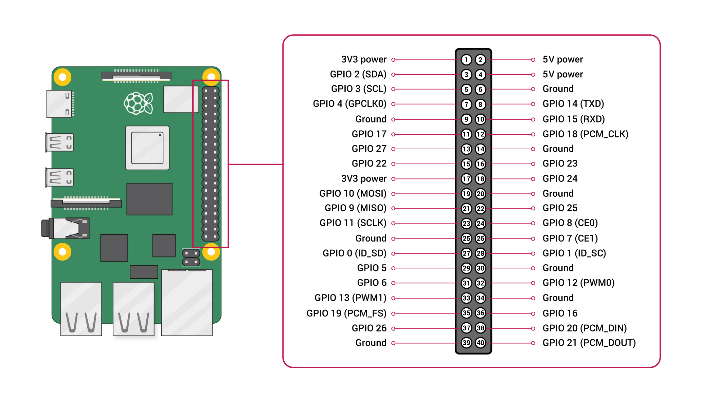
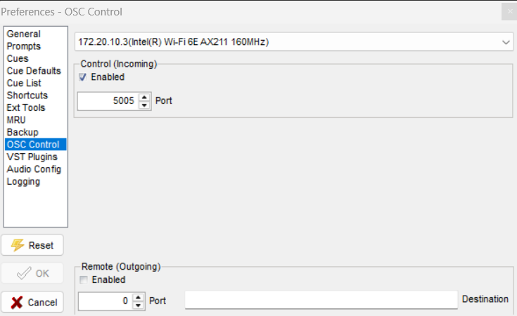

# Hardware and Software Setup 
This file details how to set up and install the software dependencies and hardware needed to run the game. 

Back to [README.md](README.md) 

---
Following is the list of hardware we will be using.  

| Item | Qty | Remarks |
| --- | --- | --- |
| Raspberry Pi 4 Model B | 2 | 1 rPi for running game code, and another for receiving UWB data through UART.  |
| Multiplay | - | For synchronised audio feedback |
| Physical button | 1 | Connected to game rPi so it can take in the button input. |
| Jumper wires | 2 | Soldered to the button and connected to rPi GPIO 27 |

This guide will be focusing on:  
1. [Setting up your Raspberry Pi](#raspberry-pi-setup-first-inital-boot)
    * [Creating a Virtual Environment](#installing-virtual-environment)
    * [Connecting a button](#connecting-a-button)

2. [Multiplay](#multiplay)

## Raspberry Pi Setup: First inital boot
1. Update the Raspberry Pi.
```
sudo apt update
sudo apt upgrade
```
If this fails, set the date and time on the Raspberry Pi before trying again.
```
sudo date -s 'YYYY-MM-DD HH:MM:SS'
```
2. Enable SSH
To enable SSH, type:
```
sudo raspi-config
```
Select
``` '3 Interface Options' ``` and then ```P2 SSH```
Enable SSH.

3. Enable VNC (Virtual Network Computing)
Type:
```
sudo raspi-config
```
Select
``` '3 Interface Options' ``` and then ```P3 VNC```
Enable VNC.  
VNC allows remote controlling of another computer, in this case our rPi.

4. Enable HDMI Hotplug  

By enabling HDMI hotplug, VNC viewer will be able to work on our Raspberry Pi without a active HDMI connection.  

First type:
```
sudo nano /boot/config.txt
```

At the bottom of the file, paste
```
hdmi_force_hotplug=1
hdmi_group=2 # HDMI display group
hdmi_mode=82 # 1900 x 1080 resolution
```
```ctrl o``` to save, then ```ctrl x``` to escape.

5. Disable Screen Blanking  

Type:
```
sudo raspi-config
```
Select
``` '2 Display Options' ``` and then ```04 Screen Blanking```
Disable Screen Blanking.  
Your Raspberry Pi will no longer go to sleep from inactivity.


## Installing Virtual Environment


1. Install Python Virtualenv

```
sudo apt install virtualenv python3-virtualenv -y
```

2. Create a new virtual environment

```
python3 -m venv --system-site-packages <enviroment_name>
```
The virtual environment will created as a folder

3. Activate the virtual environment

```
source <environment_folder>/bin/activate
```

4. Install packages

```
pip3 install python-osc==1.8.1
pip install pyserial matplotlib
pip install RPi.GPIO==0.7.1
sudo apt-get install -y libopenblas-dev python3-pil.imagetk
```

5. To deactivate environment

```
deactivate
```

To run files in the environment, use Raspberry Pi's terminal and activate the virtual environment using
```
source <environment_folder>/bin/activate
```
Then, navigate to the folder with the file you want to run using the ```cd``` command.  
If you are unable to find it, use ```ls``` to view the files and folders inside your current working directory.

## Connecting a button
Below is a diagram of the Raspberry Pi's GPIO pinout.

For our project, we will be using GPIO 27 (Pin 13) and connecting our button to it.

First, we will solder 2 female-female jumper wires to the button like so:

This is to ensure that the wires will be secured to the button and will not fall out in the midst of gameplay.  

Next, simply connect one wire to a ground pin  in the Raspberry Pi, and the other to GPIO 27.
## Multiplay

Open Multiplay>Files>Preferences  
  
Then, open OSC Control and set the port to the corresponding port number while also enabling Control (Incoming).


---
Back to [README.md](README.md)